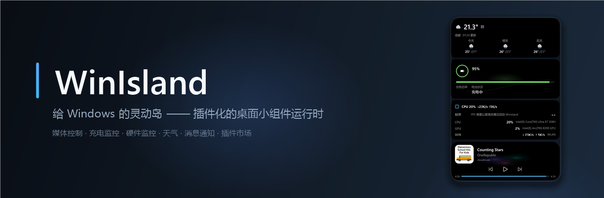
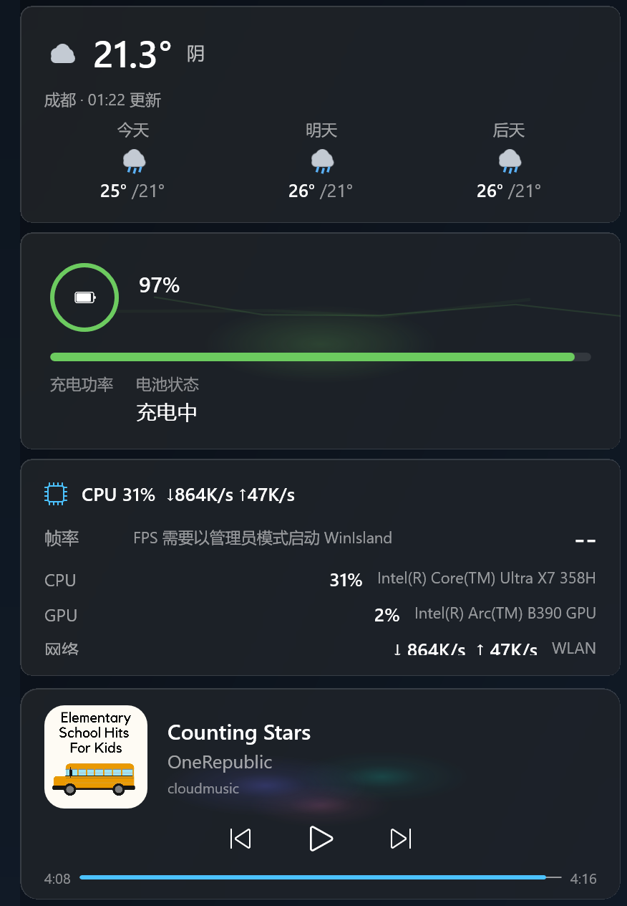
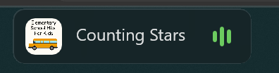
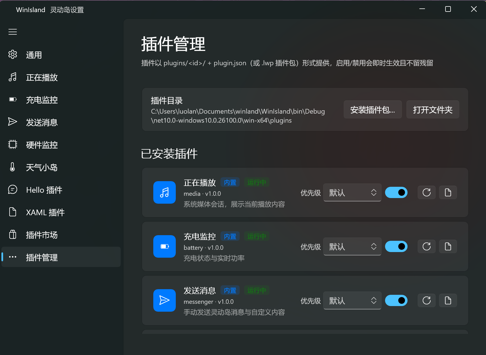
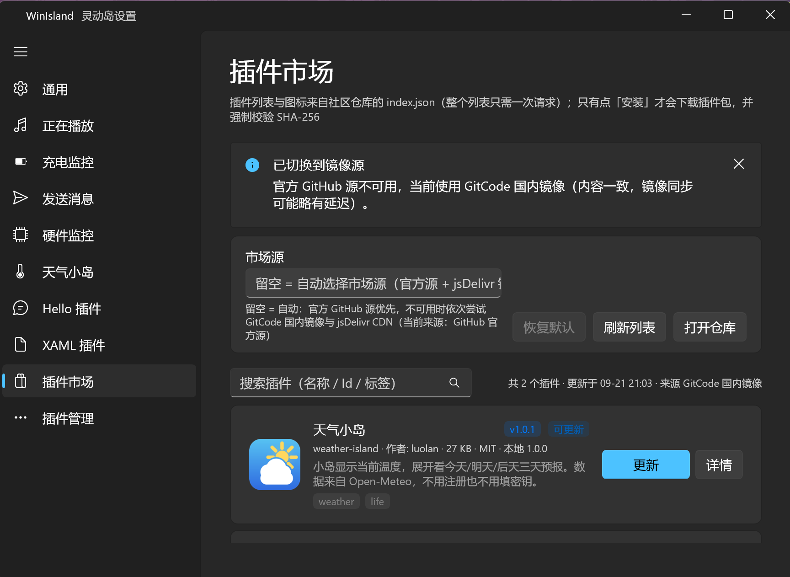
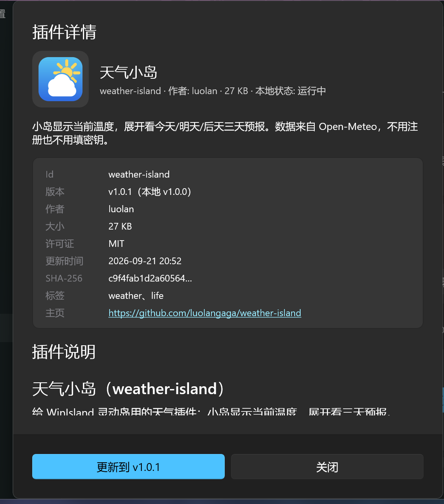
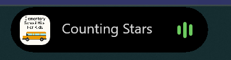
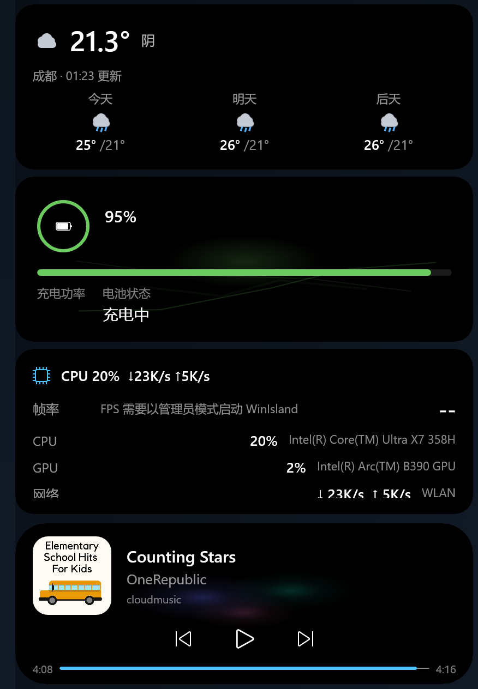
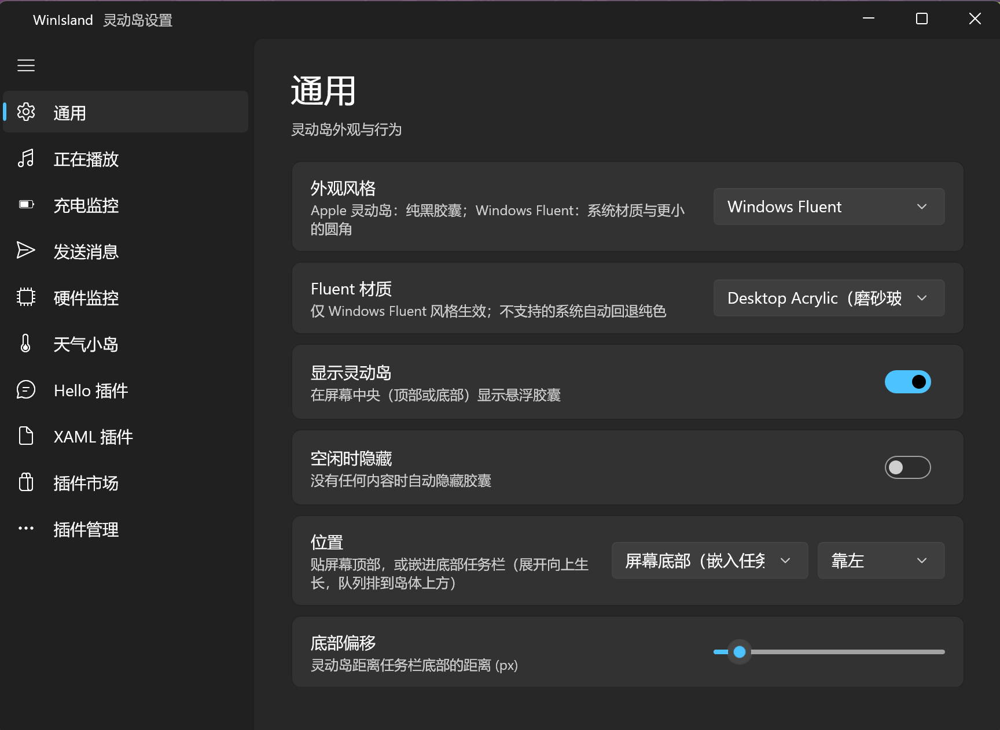

<div align="center">
  
</div>

<br>

<div align="center">

[](https://github.com/luolangaga/WinLand/releases/latest)
[](https://github.com/luolangaga/WinLand/releases)
[](#系统要求)
[](#从源码构建)
[](#插件开发)

**一个常驻桌面的悬浮胶囊：平时安静地待在角落，展开就是媒体控制台、充电与硬件看板。**

所有内容都由可热插拔的插件提供，并配有社区插件市场。

</div>

> **想给灵动岛加个功能，但不会写代码？** 把 [**WinLandPluginSkills**](https://github.com/luolangaga/WinLandPluginSkills)
> 技能装进你的 AI 助手（Claude Code / Command Code 等），然后用中文说一句需求——它会带你从零做到上架插件市场。
> 见 [插件开发 → 路线 A](#路线-a让-ai-帮你做不会编程也能用)。

---

## 它能做什么

<p align="center">
  
</p>

平时它是一枚安静的小胶囊（宽度不超过 170 逻辑像素），鼠标移上去就展开成一座「岛」：**上方的卡片是队列**——
每个在报事的插件各占一张；**最下面那张是主岛**——当前优先级最高的内容，这里是正在播放的音乐。

<p align="center">
  
</p>

<p align="center">
  <sub>紧凑态：正在播放 · Windows Fluent 风格（Desktop Acrylic 磨砂玻璃）</sub>
</p>

点击胶囊可以做当前内容的主操作（打开播放源应用、刷新天气、查看详情）。

### 功能亮点

* **两种形态** —— 紧凑胶囊 ↔ 悬停展开（主岛 + 最多 9 张队列卡片：每列 3 张、最多 3 列，放满换列），展开/收起带形变动画
* **文件投放** —— 把文件/文件夹、文本、图片拖到岛上：岛展开成一排投放卡片（拖到两端自动滚动、悬停放大、系统气泡提示「投放到 XXX」，摘要按载荷显示文件名 / 文本预览 / 图片缩略图），松手即执行；卡片可由插件注册
* **两种外观** —— Apple 纯黑胶囊，或带系统材质（Acrylic / Mica）的 Windows Fluent
* **两种摆放** —— 贴屏幕顶部悬浮，或真·嵌进任务栏条带（自动避开任务栏图标、跟随自动隐藏、被压住时自愈置顶）
* **插件系统 v2** —— 依赖隔离、热插拔、超时与异常防护、注册项全部回收
* **AI 友好** —— 配套 [`winland-plugin-maker`](https://github.com/luolangaga/WinLandPluginSkills) 技能：用中文说一句需求，
  就能让 AI 从零写出插件、装进你正在用的 WinIsland 实测，并投稿上架市场（全程不用懂编程）
* **插件市场** —— 整表一次请求、多镜像回退、安装前强制校验 SHA-256
* **更新提醒** —— 「设置 → 关于」检查新版本：先问 GitCode 国内镜像、失败回退 GitHub，只提醒不擅自安装
* **开箱即用** —— 内置「正在播放 / 充电监控 / 发送消息」三个插件，它们同时也是最好的示例代码
* **干净** —— 无边框、真透明、点击穿透（形状级）、每用户安装不需要管理员权限

---

## 插件一览

**内置插件**（随程序一起装好）：

| 插件 | 小岛显示 | 展开后 | 说明 |
|------|---------|--------|------|
| **正在播放** | 封面 + 曲名 + 跳动音条 | 封面、曲名 / 歌手、进度条与上一首 / 播放暂停 / 下一首 | 基于 Windows 系统媒体会话（GSMTC），任何播放器都能接管 |
| **充电监控** | 电量环 + 百分比 + 充放电状态 | 实时充电功率曲线、电池状态 | 用 `Windows.Devices.Power` 读电池报告，插拔时自动弹提示 |
| **发送消息** | —（没有常驻内容） | 手动推一条消息 / 自定义 XAML 控件到岛上 | 用来验证、演示和对接自己的脚本与自动化 |

**社区插件**（在「设置 → 插件市场」里一键安装）：

| 插件 | 小岛显示 | 展开后 | 说明 |
|------|---------|--------|------|
| **天气小岛** | 天气图标 + 温度 | 今天 / 明天 / 后天三天预报 | 数据来自 Open-Meteo，不用注册也不用填密钥 |
| **硬件监控** | CPU 占用 + 上下行网速 | 前台窗口 FPS、CPU / GPU 占用与型号、网络吞吐 | 想要 FPS 时需要以管理员身份运行 |

---

## 快速开始

### 系统要求

* Windows 10 1809（build 17763）或更高版本，x64 / ARM64
* 安装包是**自包含**的：.NET 运行时与 Windows App SDK 都在包里，不用另外装
* 安装到 `%LocalAppData%\Programs\WinIsland`，**全程不需要管理员权限**

### 安装

到 [Releases](https://github.com/luolangaga/WinLand/releases/latest) 下载 `WinIsland-<版本>-x64-setup.exe`（或 `-arm64-`），双击安装即可。
国内网络也可以走 [GitCode 镜像](https://gitcode.com/luolangaga/WinLand/releases)。

启动后：

* 胶囊出现在屏幕顶部中央，或嵌进任务栏（由「设置 → 通用 → 位置」决定）
* **双击托盘图标**打开设置，**右键托盘图标**可以显示/隐藏灵动岛、检查更新、退出
* 默认「空闲时隐藏」：没有任何插件在报事时自动收起，有内容再出现
* 「设置 → 关于」能看到当前版本并手动检查更新：先查 GitCode 国内镜像，失败再回退 GitHub 官方源；
  发现新版本只在设置页和岛上提醒，**下载与安装由你自己完成**（程序不会静默替换自己）

### 从源码构建

```powershell
# 需要 .NET 10 SDK；Windows App SDK 由 NuGet 还原
cd WinIsland
dotnet build
dotnet run
```

仓库里没有 `.sln`，直接构建 `WinIsland/WinIsland.csproj` 即可。发布与安装包由
[`.github/workflows/release.yml`](.github/workflows/release.yml) 在打 `v*` 标签时自动完成
（x64 / ARM64 各一份自包含产物 + Inno Setup 安装包）。仓库里配了 `GITCODE_ACCESS_TOKEN` 密钥时，
安装包会由 [`sync-to-gitcode.yml`](.github/workflows/sync-to-gitcode.yml) **同步到
[GitCode 的 Release](https://gitcode.com/luolangaga/WinLand/releases)**（客户端检查更新的首选源）；
没配就跳过，客户端会自动回退到 GitHub。需要补传某个 tag 时，在 Actions 里手动跑一次这个工作流即可。

---

## 插件开发

宿主只管「岛体」——尺寸、圆角、悬停展开、队列排版、点击穿透形状；**插件只提供内容**。

### 路线 A：让 AI 帮你做（不会编程也能用）

配套的 **AI 技能仓库 → [`luolangaga/WinLandPluginSkills`](https://github.com/luolangaga/WinLandPluginSkills)**（MIT）
把「我想给灵动岛做个东西」从零陪跑到上架社区市场：

```
想点子 → 环境体检 → 从模板建工程 → 写代码（SDK 2.0）
       → 装进你正在用的 WinIsland、你亲手实测 → 打包 .lwp
       → ★先问你同不同意★ → 上传 GitHub / 投稿插件市场
```

**第 1 步 · 安装技能**：把下面这段原样发给你的 AI 助手（Claude Code / Command Code / 任何支持 skills 的智能体）：

```text
请帮我把这个仓库里的技能装到我的技能目录，装好后告诉我怎么用：
https://github.com/luolangaga/WinLandPluginSkills
```

不想让 AI 装，也可以手动两行（技能目录：通用 `~/.agents/skills`，Claude Code 是 `~/.claude/skills`）：

```powershell
git clone --depth 1 https://github.com/luolangaga/WinLandPluginSkills.git "$env:TEMP\WinLandPluginSkills"
Copy-Item -Recurse "$env:TEMP\WinLandPluginSkills\winland-plugin-maker" "$env:USERPROFILE\.agents\skills\"
```

**第 2 步 · 直接说需求**（不用提「技能」两个字，AI 会自己认出来）：

```text
我想给 WinIsland 灵动岛写一个天气插件，小岛显示当前温度，展开后显示未来三天预报
```

技能里带齐了这些东西，AI 会自己去读：

| 技能内文件 | 作用 |
|-----------|------|
| `SKILL.md` | 全流程主文档：四条铁律 + 7 步陪跑流程（含话术，用户是新手也能跟上） |
| `references/sdk-api.md` | SDK 2.0 全部 API、线程模型、csproj 依赖规则，含 1.x 旧写法对照 |
| `references/publish.md` | GitHub 登录、上传源码、投稿市场的逐步命令 |
| `references/troubleshooting.md` | 编译 / 加载 / 动画 / 打包 排错表 |
| `assets/plugin-template/` | 开箱可编译的插件模板工程（自带 `global.json`，钉住 .NET 10） |
| `scripts/check-env.ps1`、`find-winisland.ps1` | 环境体检、自动定位你安装的 WinIsland |

> 技能里写死了两条硬性规则，防止 AI 越界：**必须装进你实际在用的那个 WinIsland、由你亲口确认效果才算测试通过**；
> **任何「发到网上」的动作（建仓库 / push / 开 PR）都必须先问你同意**。

### 路线 B：手写

一个能跑的最小插件（完整文档见 [PLUGIN.md](PLUGIN.md)）：

```csharp
using WinIsland.Core;

namespace MyPlugin;

public sealed class MyPlugin : IslandPluginBase
{
    protected override Task OnInitializeAsync()
    {
        Log.Info("插件已启动");
        Context.Island.ShowMessage(new IslandMessage { Title = "你好", Text = "来自我的插件" });
        return Task.CompletedTask;
    }

    protected override Task OnShutdownAsync()
    {
        Log.Info("插件已停用");
        return Task.CompletedTask;
    }
}
```

写完代码，用仓库里的脚本打成插件包（构建输出 + `plugin.json` → `.lwp`）：

```powershell
pwsh tools/pack-plugin.ps1 -ProjectDir samples\HelloPlugin
```

把 `.lwp` 拖进 `plugins/` 目录，或从「设置 → 插件管理 → 安装插件包…」安装：

<p align="center">
  
</p>

<p align="center">
  <sub>插件管理：安装 / 启停 / 调优先级 / 重新加载 / 看日志，全部即时生效</sub>
</p>

### 插件系统 v2 的几条硬规矩

| 主题 | 行为 |
|------|------|
| **依赖隔离** | 每个插件跑在可回收的 `AssemblyContext` 里；`WinIsland.Core`、`System.*`/`Windows.*` 与宿主目录里已有的程序集统一绑定到宿主，其余依赖从插件目录解析（支持插件自带 NuGet 依赖） |
| **热插拔** | 禁用 → 卸载程序集（用 `WeakReference` 验证真的被回收）→ 重新启用；更新/删除时先改名移走旧目录，绝不删除正在加载的文件 |
| **注册即回收** | 插件注册的设置页、常驻内容、临时消息、定时器、设置订阅都记在 `PluginScope` 里，停用时统一撤销——**插件自己清理得不干净，宿主兜底** |
| **防护** | 初始化 10 秒超时；单次会话 5 次未处理异常自动停用；所有从宿主进入插件的回调都被包在守卫里（一个插件抛异常不会让整个应用变成 WinUI 的「stowed exception」崩溃） |
| **只读契约** | `WinIsland.Core` 只有接口、数据与特性，没有实现；插件设置自动加上 `<插件 id>.` 前缀，插件改不到宿主的设置 |

### 样例

| 样例 | 内容 |
|------|------|
| [`samples/HelloPlugin`](samples/HelloPlugin) | 代码构建 UI、私有依赖、设置页、定时器、完整清理 |
| [`samples/XamlPlugin`](samples/XamlPlugin) | XAML 视图 + `PluginXaml.Load` + 逐帧形变动画 |
| [`samples/HardwareMonitor`](samples/HardwareMonitor) | 真实功能插件：CPU / GPU / 网络 / 帧率，自带 NuGet 依赖 |
| [`samples/WeatherIsland`](samples/WeatherIsland) | 网络数据 + 定时刷新 + 主题适配 + 「超级展开」聚光卡 |
| [`samples/DeviceIsland`](samples/DeviceIsland) | 设备热插拔监听（Win32 / Core Audio / PnP 属性）、多条目列表与逐条操作 |

---

## 插件市场

「设置 → 插件市场」读取社区仓库 [`luolangaga/WinLandPlugin`](https://github.com/luolangaga/WinLandPlugin) 根目录的 `index.json`：

* **整个列表只发一次请求**，插件图标以 base64 内嵌在清单里（不做逐插件请求）
* 市场源自动回退：GitHub raw → GitCode 国内镜像 → jsDelivr，客户端记住上次成功的源；也可以用 `marketplace.baseUrl` 指向自建源
* 只有点「安装」才会下载 `.lwp`，且**强制校验 SHA-256**；README 只在打开「详情」时才取

<p align="center">
  
</p>

<p align="center">
  
</p>

<p align="center">
  <sub>详情页能看到版本 / 作者 / 体积 / 许可证 / SHA-256 与插件自带的说明，README 只在打开详情时才取</sub>
</p>

想投稿？把 `plugin.json` + `<id>.lwp` + `logo.png`（可选）+ `README.md`（可选）放进 `plugins/<id>/` 提 PR，
合并后 Action 会自动重建清单（细节见 [PLUGIN.md §9](PLUGIN.md)）。

---

## 外观与摆放

| | Apple 灵动岛 | Windows Fluent |
|---|---|---|
| 紧凑态 |  |  |
| 展开态 |  |  |

* **Apple 灵动岛**：不透明纯黑胶囊、大圆角——最接近 iPhone 上的样子
* **Windows Fluent**：元素级系统材质（Desktop Acrylic 磨砂玻璃 / Mica 壁纸着色）、1px 描边、小圆角，材质不可用时自动回退纯色

摆放方式有两种，都在「设置 → 通用」里：

* **屏幕顶部**：贴工作区顶部悬浮，队列向下生长
* **屏幕底部（嵌入任务栏）**：真的嵌进任务栏条带——自动测量任务栏的空闲段落位（不再假设左边一定是空的）、
  跟随任务栏自动隐藏、被别的窗口压住时自动重新置顶；队列向上生长

通用设置页：

<p align="center">
  
</p>

---

## 架构

```
WinIsland.Core/           插件 SDK（luolan.winland.Core，API v2）——只有接口、数据与特性
WinIsland/                主程序（WinUI 3 / .NET 10 / Windows App SDK）
  Island/                 岛体窗口：状态机、尺寸动画、悬停展开、队列排版、点击穿透形状、摆放策略、文件投放面板
  Core/
    Plugins/              插件引擎：发现 / 安装 / 启用 / 热重载 / 卸载，可回收 ALC 与作用域回收
    DropTargets/          宿主内置的文件投放动作（打开 / 所在位置 / 复制路径）
    Marketplace/          插件市场客户端：index.json + ETag 缓存 + 镜像回退 + SHA-256 校验
    Update/               更新检查：GitCode 优先 → 失败回退 GitHub（只提醒，不下载不安装）
    SettingsService.cs    设置存储（%LocalAppData%\WinIsland\settings.json）
    Win32.cs              窗口样式、DWM、任务栏条带、topmost 自愈、窗口形状等全部 P/Invoke
  Modules/                内置插件：Media / Battery / Messaging
  Settings/               设置窗口与各页面（通用 / 插件市场 / 插件管理 / 关于）
samples/                  插件样例：HelloPlugin / XamlPlugin / HardwareMonitor
tools/pack-plugin.ps1     把插件目录打成 .lwp
installer/WinIsland.iss   Inno Setup 安装脚本（每用户安装，无需管理员）
```

几个值得一提的实现细节：

* **点击穿透用窗口形状，不用 `WM_NCHITTEST`**：`SetWindowRgn` 把透明画布裁成岛屿的真实形状（带圆角），
  形状之外的像素不属于这个窗口，点击/触摸会直接落到下面的窗口——包括其它进程的窗口。
* **绝不在展开动画里改窗口大小**：改客户区宽度会让 DWM 把上一帧按旧坐标合成进新窗口矩形，
  出现一帧「重影」。画布是预留的，展开只动 XAML 内的岛体尺寸。
* **topmost 自愈**：任务栏、开始菜单、搜索面板会随时把自己抬到最上层，所以窗口在「任何覆盖自己矩形的可见窗口」之上时
  会重新断言置顶；这条逻辑在所有摆放模式下都生效。
* **投放面板是岛体的一种内容状态**（与临时消息同级）：面板尺寸是常量、启动时就预留进画布，所以拖拽全程不改窗口几何；
  卡片长在岛体内部，点击穿透形状与几何不变式完全不受影响。
* **一切都可回收**：插件卸载后不能留下任何东西——设置页、常驻内容、临时消息、定时器、订阅，
  以及（用 `WeakReference` 验证过的）程序集本身。

---

## 常见问题

**Q：会挡住全屏游戏吗？**
独占全屏 / 全屏优化的游戏、UAC 安全桌面、锁屏界面在 topmost 波段之外，灵动岛不会盖在上面。

**Q：为什么展开时队列卡片一样宽、一样高？**
这是设计：一列对齐的卡片比参差不齐更好看，所以宿主会统一卡片尺寸，插件视图请用星号/自适应布局，
不要假定自己的声明尺寸就是最终尺寸。

**Q：插件能读到我的隐私数据吗？**
插件与你自己的程序同样权限运行（不是沙箱），装插件前请看清来源；宿主会在插件出错时保护自身不崩，
但这不等于安全隔离。市场里下载的包在安装前会校验 SHA-256。

**Q：日志在哪里？**
`%LocalAppData%\WinIsland\logs\`：`plugin.host.log` 是宿主日志，每个插件另有 `plugin.<id>.log`。

**Q：怎么更新到新版本？**
「设置 → 关于」或右键托盘图标 →「检查更新…」：先查 GitCode 国内镜像，失败回退 GitHub 官方源，
版本更新的那一版会连同更新说明一起显示出来。下载与安装由你自己点按钮完成——程序不会在后台下载、
也不会静默替换自己；不想再看到的那一版可以点「跳过此版本」。
（检查的仓库默认是官方仓库，开发验证时可以用设置键 `update.repo` = `owner/repo` 指到别处。）

---

## 相关链接

* 用 AI 做插件（推荐）：[luolangaga/WinLandPluginSkills](https://github.com/luolangaga/WinLandPluginSkills)
* 插件开发指南（手写）：[PLUGIN.md](PLUGIN.md)
* 社区插件仓库：[luolangaga/WinLandPlugin](https://github.com/luolangaga/WinLandPlugin)
* 问题反馈：[Issues](https://github.com/luolangaga/WinLand/issues)
* 下载：[Releases](https://github.com/luolangaga/WinLand/releases)

<div align="center">
  <sub>WinUI 3 · .NET 10 · Windows App SDK 2.3 · 插件 API v2</sub>
</div>
